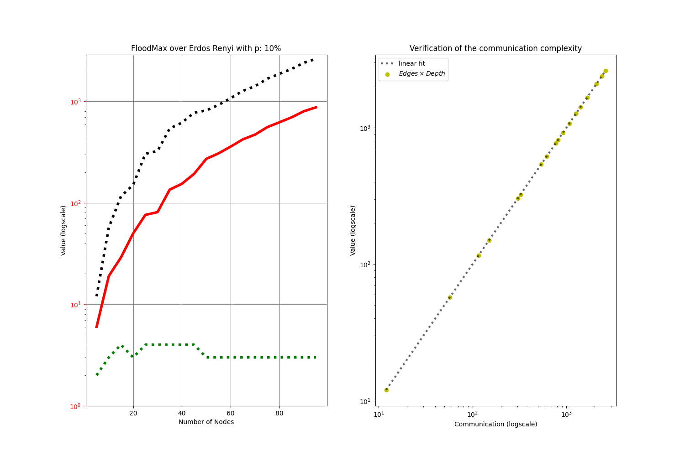
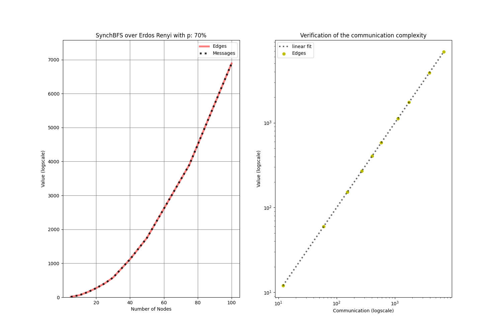
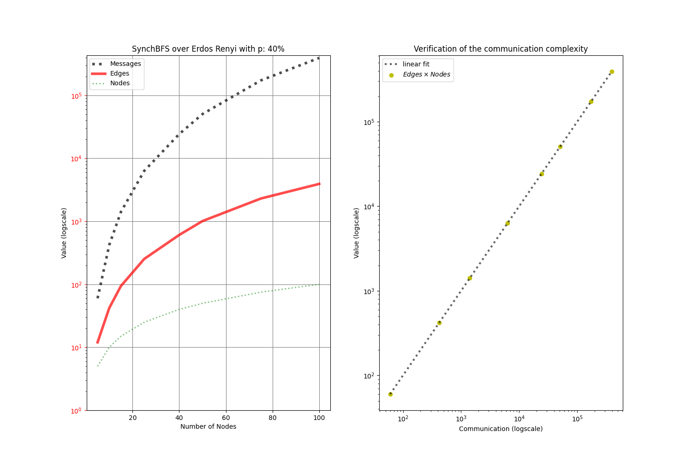

# distributed-algorithms-graphs-simulation
<b>Info:</b>

Simulation of synchronic distributed algorithms over weighted directed networks implemented in Python

<b>Watching Graphs</b> 

`python3 Graph.py N f b`

where N is the number of nodes, f the Erdos Renyi probability, and b can be 0 or 1 to determine if it is undirected (1) or not (0).

To make the following picture the command was 

`python3 Graph.py 8 0.3 1`.

<b>Leader Election (FloodMax)</b>

The distributed algorithm called FloodMax is able to elect a leader.

From the raw simulation results (left), it can be noted (right) that the communication complexity is `O(|Edges|Depth)` (p.54 Distributed  Algorithms, Nancy Lynch)

To produce the simulation run `./FloodMax.sh`

<b>Tree Building (SynchBFS)</b>

In synchronous networks, as those here simulated, the distributed algorithm called SynchBFS is able to build the breadth-first tree.

From the raw simulation results (left), it can be noted (right) that the communication complexity is `O(|Edges|)` (p.58 Distributed  Algorithms, Nancy Lynch)

To produce the simulation run `./SynchBFS.sh`

<b>Routing (<i>BellmanFord</i>)</b>

The distributed algorithm called BellmanFord is able to build the optimal path for routing.

From the raw simulation results (left), it can be noted (right) that the communication complexity is `O(Nodes|Edges|)` (p.62 Distributed  Algorithms, Nancy Lynch)

To produce the simulation run `./BellmanFord.sh`

<b>Configuration</b>

The probability of the Erdos Renyi graph `p` and the exact sequence of number of nodes `[N1,...,Nm]` can be configured at each simulation's main file.
